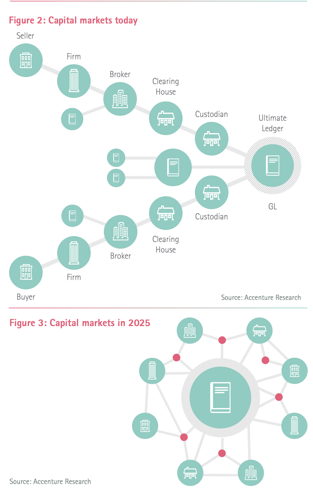
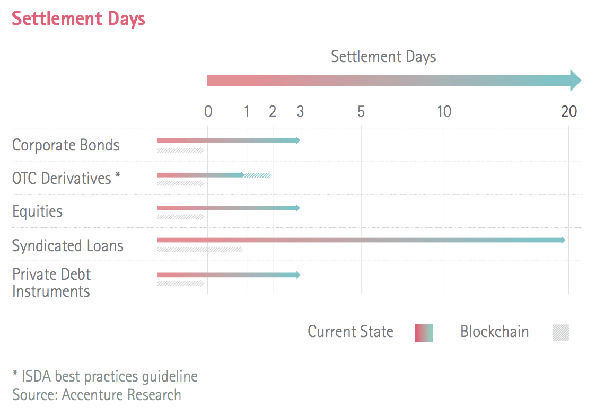
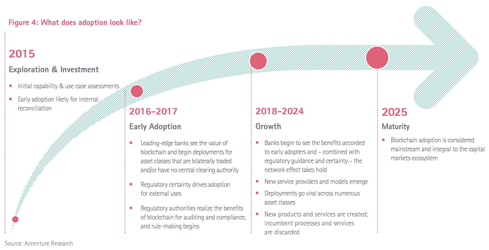
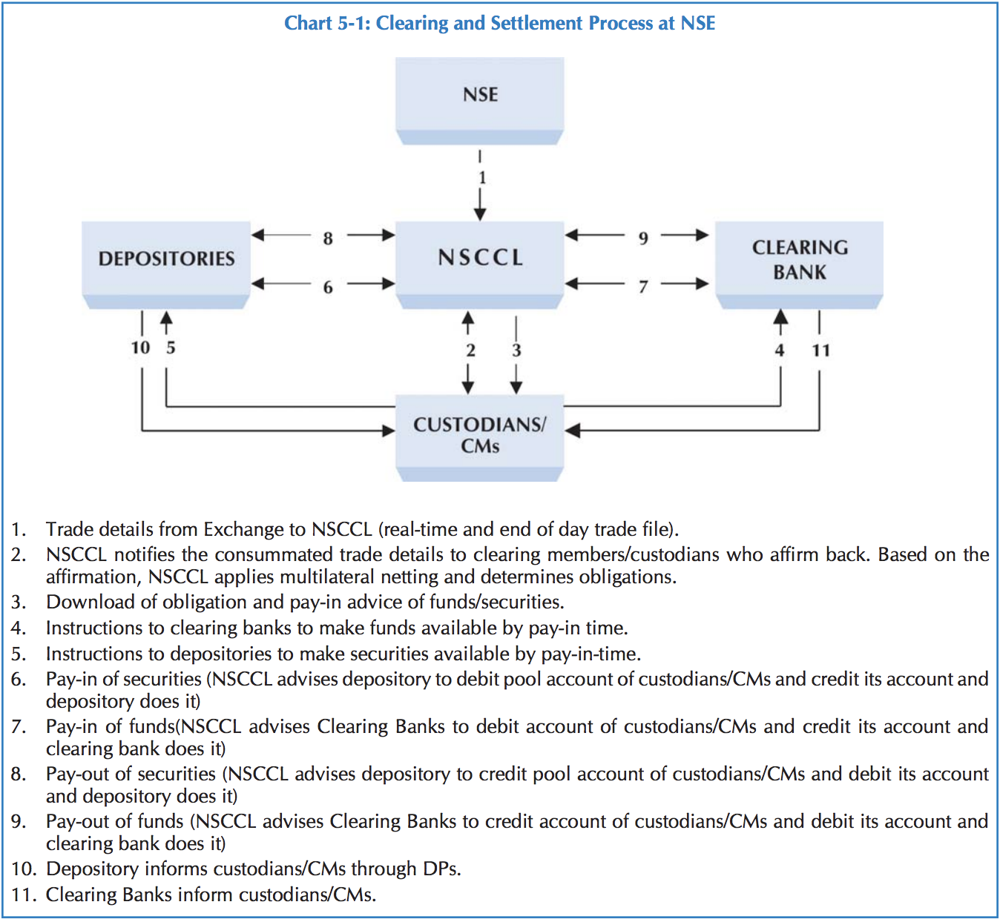

# Reports and Papers About 

## General Finance
- CENTRAL BANK OF MALAYSIA : [FINANCIAL SECTOR BLUEPRINT 2011-2020](http://www.bnm.gov.my/files/publication/fsbp/en/BNM_FSBP_FULL_en.pdf)

- Asian Development Bank : [Financial Sector Blueprint for 2001-2010](https://www.adb.org/sites/default/files/publication/27921/cam-blueprint-2001.pdf)

- Brazilian Journal of Political Economy: [Emerging markets and the international financial architecture](http://www.scielo.br/pdf/rep/v35n2/0101-3157-rep-35-02-00285.pdf)

- European Parliamentary Research Service : [Distributed ledger technology and financial markets](http://www.europarl.europa.eu/RegData/etudes/BRIE/2016/593565/EPRS_BRI(2016)593565_EN.pdf)

- Santander InnoVentures, Oliver Wyman and Anthemis Group: [The Fintech 2.0 Paper: rebooting financial services](http://santanderinnoventures.com/wp-content/uploads/2015/06/The-Fintech-2-0-Paper.pdf)

- Accenture Research: [Blockchain Technology: Preparing for Change](https://www.accenture.com/t20160608T052656__w__/us-en/_acnmedia/PDF-5/Accenture-2016-Top-10-Challenges-04-Blockchain-Technology.pdf)

   

   

   

## Clearing and Settlement
- IOSCOPD21.pdf : [Clearing And Settlement in Emerging Markets](https://www.iosco.org/library/pubdocs/pdf/IOSCOPD21.pdf)

- Bank Of England:  [A blueprint for a new RTGS service for the United Kingdom](https://www.bankofengland.co.uk/-/media/boe/files/payments/a-blueprint-for-a-new-rtgs-service-for-the-uk)

- [Developing Blockchain Real-Time Clearing and Settlement in the EU, U.S., and Globally](http://cjel.law.columbia.edu/preliminary-reference/2016/developing-blockchain-real-time-clearing-and-settlement-in-the-eu-u-s-and-globally-2/)

## Payment
- Blueprint for the Future of UK Payments.pdf: [Blueprint for the Future of UK Payments](https://implementation.paymentsforum.uk/sites/default/files/Consultation%20Document.pdf)

- payment_for_Europe.pdf : [Instant retail payments for Europe: a Blueprint](https://www.wsbi-esbg.org/SiteCollectionDocuments/1159.pdf)

- About Global Instant Payment: [A New Blueprint for Global Instant Payments](https://iconsolutions.com/blog/beyond-babel-new-blueprint-global-instant-payments-part-1/)

- Federal Reserve : [Strategies for Improving the U.S. Payment System](https://fedpaymentsimprovement.org/wp-content/uploads/strategies-improving-us-payment-system.pdf)

- EUROPEAN COMMISSION: [Cross-Border Clearing and Settlement Arrangements in the European Union](https://ec.europa.eu/info/system/files/first_giovannini_report_en.pdf)

- EUROPEAN COMMISSION : [Cross-border clearing and settlement arrangements in the European Union](http://ec.europa.eu/economy_finance/publications/pages/publication1950_en.pdf)

## Security Market 
- target2.pdf : [TARGET2-SECURITIES THE BLUEPRINT](https://www.ecb.europa.eu/pub/pdf/other/t2sblueprint0703en.pdf?b49eeb389d1fe47bf5e8dcccc0cf3587)

- Federation Of European Securities Exchange: [A BLUEPRINT FOR EUROPEAN CAPITAL MARKETS](https://fese.eu/app/uploads/2018/11/141125_FESE-BluePrint.pdf)

- A Blueprint for Derivatives Market.pdf : [The Global Derivatives Market A Blueprint for Market Safety and Integrity](https://deutsche-boerse.com/resource/blob/79206/c45b15c5cf7f0531f3664d4304934961/the-global-derivatives-market-0909_de-data.pdf)

- Securities Commission Malaysia: [Capital Market Architecture Blueprint in a Decentralised World](https://castor.my/wp-content/themes/castor/assets/blueprint.pdf)

- International CSD Euroclear : [Blockchain settlement Regulation, innovation and application : Regulatory and legal aspects related to technology in post-trade settlement](https://www.euroclear.com/dam/PDFs/Blockchain/MA3880%20Blockchain%20S&M%209NOV2016.pdf)

- Association for Financial Markets in Europe : [Post Trade explained](https://www.afme.eu/globalassets/downloads/publications/afme-post-trade-explained.pdf)

- [Cross-Border Securities Clearing and Settlement Infrastructure](https://ageconsearch.umn.edu/record/26138/files/dp040287.pdf)

- 欧洲央行: [THE SECURITIES CUSTODY INDUSTRY](https://www.ecb.europa.eu/pub/pdf/scpops/ecbocp68.pdf?5ff757225862fdd1894d8dab08815b19)

-  Oliver Wyman: [SECURITIES SERVICES:  THE GOOD TIMES ARE OVER](https://www.oliverwyman.com/content/dam/oliver-wyman/global/en/2015/jun/Securities_Services_2015.pdf)

- [International Clearing and Settlement](https://www.princeton.edu/~ota/disk2/1990/9043/904308.PDF)

- [Capital Market - Clearing and Settlement](https://www.nseindia.com/education/resources/download/ismr2009ch5.pdf)
   

## Regulation
- [Real-Time Regulation and Blockchain Data](https://static1.squarespace.com/static/59234cbd6a496341d7c59306/t/597feb7d8419c2fefbe7e60b/1501555585537/Bandman+keynote+July+20%2C+2017+P2PFISY+-+Final+for+Publication.pdf)

- [Swift - Financial crime compliance services](https://www.swift.com/our-solutions/compliance-and-shared-services/financial-crime-compliance)
    - KYC
    - Sanctions Screening
    - Compliance Analytics
    - Name Screening
    - Payment Data Quality
    - Daily Validation Reports

## Digital Identity
- Deloitte : [A blueprint for digital identity](https://www2.deloitte.com/content/dam/Deloitte/global/Documents/Financial-Services/gx-fsi-digital-identity-online.pdf)

- [Digital-Identity-of-Legal-Entities: Current-Status-and-Way-Forward_Journal-of-Payments](https://www.gleif.org/_documents/blog/20180530-the-use-of-the-legal-entity-identifier-in-payment-systems/Gerard-Hartsink_The-Digital-Identity-of-Legal-Entities_Current-Status-and-Way-Forward_Journal-of-Payments-Strategies&Systems_Volume12_Number1.pdf)

## Standard
- Book: ISO 20022 Dummies
- [Understanding ISO 20022](https://fedpaymentsimprovement.org/wp-content/uploads/understanding-iso-20022.pdf)

## Book

- By David Loader: [Clearing, Settlement and Custody](https://www.oreilly.com/library/view/clearing-settlement-and/9780080983332/)

- By David Loader: [UNDERSTANDING THE MARKETS]()

- [global custody and clearing services](https://max.book118.com/html/2017/0731/125514430.shtm)

- [clearing and settlement of derivatives](https://max.book118.com/html/2017/0728/124809614.shtm)

- [CROSS BORDER CLEARANCE SETTLEMENT AND CUSTODY]()

- [book118](https://max.book118.com/)

## Research

- [R3 Research Papers](https://www.r3.com/research/)
